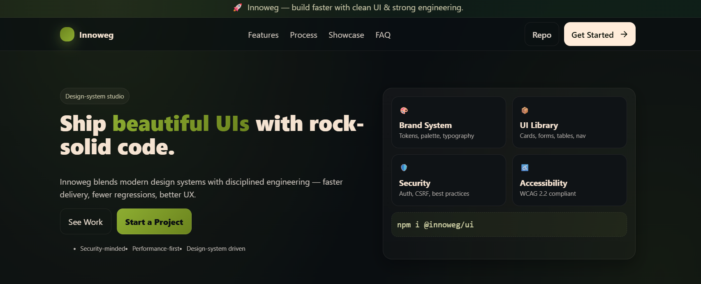

# Innoweg — Landing UI (React + Vite + CSS Modules)

<p align="center">
  <a href="https://github.com/jfaza/InnoW/blob/master/LICENSE">
    
  </a>
  <a href="https://github.com/jfaza/InnoW/commits/master">
    
  </a>
  
  
  
</p>

A clean, responsive landing page for **Innoweg**, focused on design systems and solid engineering.  
Built with **React**, **Vite**, and **CSS Modules**.



---

## ✨ Features
- Modern landing layout (Hero, Features, Process, Showcase, FAQ, CTA)
- **CSS Modules** for scoped styles (no global conflicts)
- Fully responsive grid with accessible colors/contrast
- Minimal dependencies → lightning-fast build
- Ready for deployment on Vercel / Netlify / GitHub Pages

---

## 🧰 Tech Stack
- **React 19** + **Vite 7**
- **CSS Modules** (clean separation of view & style)
- No Tailwind/Bootstrap → pure fundamentals
- Optional: Framer Motion + Lucide icons (already installed, can be used)

---

## 🚀 Run Locally
Clone and run the project:

```bash
git clone https://github.com/jfaza/InnoW.git
cd InnoW
npm install
npm run dev
# open http://localhost:5173
